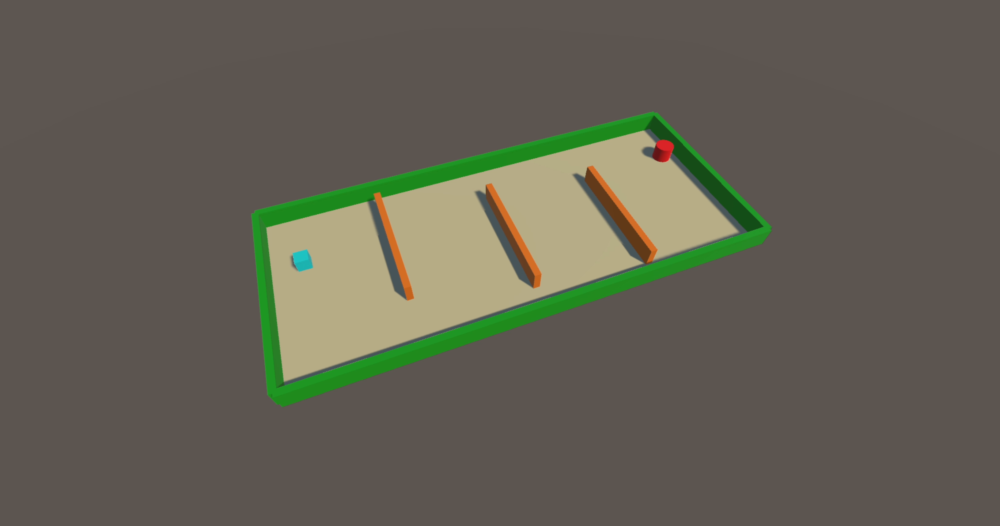

# Deep Q-Learning applied to Custom-Built Unity Environment

* Trained on PyTorch 2.3.0 and mlagents-envs 1.0.0
* Using Python 3.10.11

## Contents
* [Repository Files](#repository-files)
* [Unity Environment](#unity-environment)
* [Model and Deep Q-Learning](#model-and-deep-q-learning)
* [Inference](#inference)

## Repository Files

* unity_environment.cs - This C-Sharp file contains the functions of the custom-built Unity environment.
* deep_q.py - This python file contains the Q-Network and the training and inference scripts.
* Unity_Environment.app - This is a MacOS version of the Unity environment used in the inference step.
* Demo.mp4 - This video file demonstrates an inference run of 30 episodes using the trained policy_model.
* unity_weights.pth - This file contains the trained weights for the policy model.
* environment_picture.png - This is an image of the Unity environment.

## Unity Environment

The custom-built environment used here was made using the Unity game engine. It is a simple obstacle course. 



The objects in the environment are described below:
* Blue Cube - the agent
* Red Pillar - the main target (end_goal)
* Orange Walls - moving obstales that oscillate from side to side

The agent is required to maneuver around these moving obstacles to reach the red target.

The Reward system of the environment is described below:
* If the agent moves in a direction opposite to the direction of the obstacle immediately in front of it, then Reward = 0.02. Else Reward = - 0.02.
* After the agent has crossed the third obstacle, if it moves closer to the red target, then Reward = 0.02, Else Reward = - 0.02.
* If the agent reaches the red target, then Reward = 1.

The features returned in the observation state are desscribed below:
* the agent's position
* the position and direction of movement of the three obstacles
* the red target's position

This Unity environment is converted to a Gym environment using a Gym wrapper before being used to train the policy model.

## Model and Deep Q-Learning

The model is a simple sequence of Linear layers with Tanh activations between the layers. The model is trained using the Deep Q-Learning method.

For implementing the Deep Q-Learning method, several ideas were used from the following PyTorch Tutorial:

```Bibtex
https://pytorch.org/tutorials/intermediate/reinforcement_q_learning.html
```

## Inference
Inference for the trained policy_model was run for 30 episodes. For each of the 30 epsidoes, the agent was able to reach the red target. It can be safely assumed that the model has converged. A video recording of the inference is shown in the Demo.mp4 video file. 
